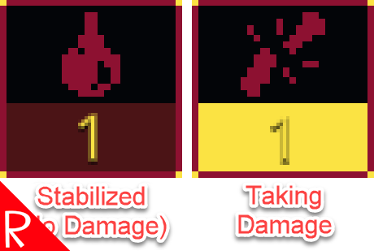

# Quasimorph Highlight Damaging Effects

# Important - This version of the mod is only for the opt in beta version of the game!

This is a temporary version that supports the 0.8.6 beta, and not the current game's version.
For the non beta version of the game, use the mod of the same name without the BETA suffix.

The non beta version *must* be uninstalled.  
When the 0.8.6 becomes the main version, this mod will be deleted.
Note that the beta is expected to change many times before release.
As such, this mod may break on each beta release.

# Docs

Highlights the bottom of the wound icon when when a wound is actively causing damage.

When in the middle of battle, it can be difficult to notice that a new -2 HP per action point wound has been added to the existing wounds.

This mod highlights the wound boxes that are causing damage.

The color can be changed in the configuration file.

## Game Difficulty
The game notifies a player that they are taking damage by flashing the wound and player as well as making a "crunching" sound.  The subtly of the notification may be a gameplay decision.  

For example, in combat a person can be filled with so much adrenaline that they are unaware that they are wounded.

If that is the game's intent, this mod would be considered a difficulty reduction rather than a QoL.

However, since I was checking the wound panels constantly, it is more of a QoL for me.

# Configuration

The configuration file will be created on the first game run and can be found at `%AppData%\..\LocalLow\Magnum Scriptum Ltd\Quasimorph_ModConfigs\QM_HighlightDamagingEffects\config.json`.

|Name|Default|Description|
|--|--|--|
|HighlightColor|#FBE343|The highlighting color.  Defaults to the game's yellow color.  Must have the # prefix.|

# Support
If you enjoy my mods and want to buy me a coffee, check out my [Ko-Fi](https://ko-fi.com/nbkredspy71915) page.
Thanks!

# Source Code
Source code is available on GitHub at https://github.com/NBKRedSpy/QM_HighlightDamagingEffects

# Change Log
## 1.1.0
* Restored pre 0.8.6 highlighting
* Fixed: Fixating a wound would not update the wound panel.

## 1.1.0
* Compatible with the 0.8.6 opt in beta 
* Temporary version that inverts wound fixation colors
